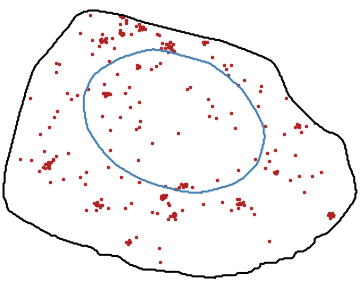

# Sim-FISH

[](https://badge.fury.io/py/sim-fish)
[](https://travis-ci.com/fish-quant/sim-fish)
[](https://sim-fish.readthedocs.io/en/latest/?badge=stable)
[](https://codecov.io/gh/fish-quant/sim-fish)
[](https://github.com/fish-quant/sim-fish/blob/main/LICENSE)
[](https://pypi.python.org/pypi/sim-fish/)

**Sim-FISH** is a python package to **simulate smFISH images**. The package allows the user simulate and localize spots, cells and nuclei. The ultimate goal is to provide toy images to **experiment, train and evaluate smFISH statistical analysis**.

User can simulate images of spots and clusters with different level of noise...

| Spots | Clustered  spots |
| ------------- | ------------- |
|  |  |

... or localization patterns within  subcellular regions.

| Perinuclear pattern | Foci pattern |
| ------------- | ------------- |
|  |  |

## Installation

### Dependencies

Sim-FISH requires Python 3.6 or newer. Additionally, it has the following dependencies:

- big-fish (>= 0.6.1)
- joblib (>= 0.13.2)
- numpy (>= 1.16.0)
- scikit-image (>= 0.14.2)
- matplotlib (>= 3.0.2)
- pandas (>= 0.24.0)

### Virtual environment

To avoid dependency conflicts, we recommend the the use of a dedicated [virtual](https://docs.python.org/3.6/library/venv.html) or [conda](https://docs.conda.io/projects/conda/en/latest/user-guide/tasks/manage-environments.html) environment.  In a terminal run the command:

```bash
conda create -n simfish_env python=3.6
source activate simfish_env
```

We recommend two options to then install Sim-FISH in your virtual environment.

#### Download the package from PyPi

Use the package manager [pip](https://pip.pypa.io/en/stable/) to install Sim-FISH. In a terminal run the command:

```bash
pip install sim-fish
```

#### Clone package from Github

Clone the project's [Github repository](https://github.com/fish-quant/sim-fish) and install it manually with the following commands:

```bash
git clone git@github.com:fish-quant/sim-fish.git
cd sim-fish
pip install .
```

## Usage

Sim-FISH provides a toolbox to simulate smFISH images. A complete [documentation](https://sim-fish.readthedocs.io/en/stable/) is available online. 

This package is part of the [FISH-Quant](https://fish-quant.github.io/) framework.

## Support

If you have any question relative to the repository, please open an [issue](https://github.com/fish-quant/sim-fish/issues). You can also contact [Arthur Imbert](mailto:arthur.imbert@mines-paristech.fr).

## Roadmap (suggestion)

Version 0.Y.0:
- Improve background noise simulation.
- Improve PSF simulation.
- Cell and nucleus simulation in 2D.
- Cell and nucleus simulation in 3D.
- Allow benchmark and valuation pipeline.
- Add simulation of colocalized spots
- Add examples

Version 1.0.0:
- Complete code coverage.

## Development

### Source code

You can access the latest sources with the commands:

```bash
git clone git@github.com:fish-quant/sim-fish.git
cd sim-fish
git checkout develop
```

### Contributing

[Pull requests](https://github.com/fish-quant/sim-fish/pulls) are welcome. For major changes, please open an [issue](https://github.com/fish-quant/sim-fish/issues) first to discuss what you would like to change.

### Testing

Please make sure to update tests as appropriate if you open a pull request. You can install exacts dependencies and specific version of [pytest](https://docs.pytest.org/en/latest/) by running the following command:

```bash
pip install -r requirements_dev.txt
```

To perform unit tests, run : 

```bash
pytest simfish
```

## Citation

If you exploit this package for your work, please cite:

> Arthur Imbert, Wei Ouyang, Adham Safieddine, Emeline Coleno, Christophe Zimmer, Edouard Bertrand, Thomas Walter, Florian Mueller. FISH-quant v2: a scalable and modular analysis tool for smFISH image analysis. bioRxiv (2021) https://doi.org/10.1101/2021.07.20.453024
