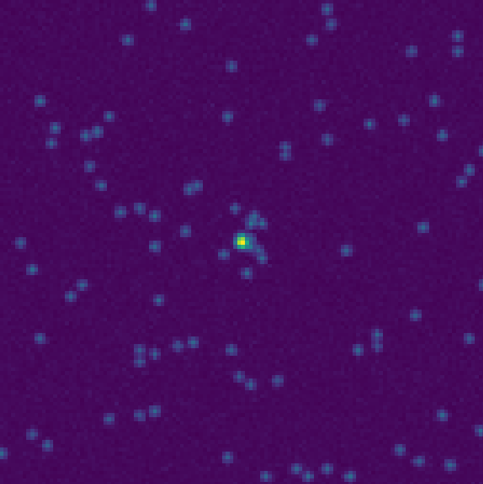

.. _image_simulation overview:

Image simulation
****************

.. currentmodule:: simfish

Functions used to simulate spot images, in 2D and 3D.

+------------------+------------------+------------------+
|      |pic1|      |      |pic2|      |      |pic3|      |
+------------------+------------------+------------------+

.. |pic1| image:: ../../images/plot_spot.png
   :width: 100%

.. |pic2| image:: ../../images/plot_cluster_zoom.png
   :width: 100%

Simulation is performed in three steps:

#. We simulate ground truth coordinates.

    * :func:`simfish.simulate_ground_truth`

#. From an empty frame we simulate a gaussian signal in every spot location.

    * :func:`simfish.add_spots`

#. We add an additive background noise in image if needed.

    * :func:`simfish.add_white_noise`

The full process can be run with:

* :func:`simfish.simulate_images`
* :func:`simfish.simulate_image`

.. autofunction:: simulate_ground_truth
.. autofunction:: add_spots
.. autofunction:: add_white_noise
.. autofunction:: simulate_images
.. autofunction:: simulate_image