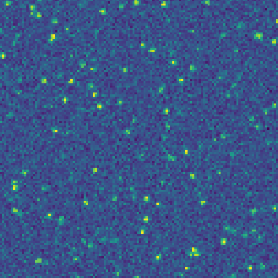
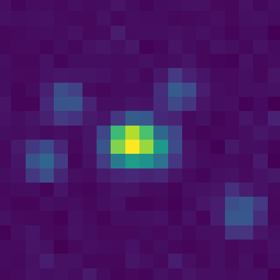
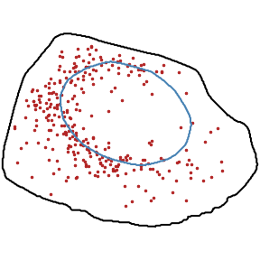

.. sim-fish documentation main file, created by
   sphinx-quickstart on Thu Nov 19 22:45:09 2020.
   You can adapt this file completely to your liking, but it should at least
   contain the root `toctree` directive.

Sim-FISH
********

+------------------+------------------+------------------+
|      |pic1|      |      |pic2|      |      |pic3|      |
+------------------+------------------+------------------+

Getting started
===============

To avoid dependency conflicts, we recommend the the use of a dedicated
`virtual <https://docs.python.org/3.6/library/venv.html>`_ or `conda
<https://docs.conda.io/projects/conda/en/latest/user-guide/tasks/manage-
environments.html>`_ environment.  In a terminal run the command:

.. code-block:: bash

   $ conda create -n simfish_env python=3.6
   $ source activate simfish_env

We recommend two options to then install Sim-FISH in your virtual environment.

Download the package from PyPi
------------------------------

Use the package manager `pip <https://pip.pypa.io/en/stable>`_ to install
Sim-FISH. In a terminal run the command:

.. code-block:: bash

   $ pip install sim-fish

Clone package from Github
-------------------------

Clone the project's `Github repository <https://github.com/fish-quant/sim-
fish>`_ and install it manually with the following commands:

.. code-block:: bash

   $ git clone git@github.com:fish-quant/sim-fish.git
   $ cd sim-fish
   $ pip install .

------------

API reference
*************

.. toctree::
   :caption: Simulations

   image_simulation
   pattern_simulation
   utils

------------

Support
=======

If you have any question relative to the package, please open an `issue
<https://github.com/fish-quant/sim-fish/issues>`_ on Github.

------------

Citation
========

If you exploit this package for your work, please cite:

.. code-block:: text

    Arthur Imbert, Wei Ouyang, Adham Safieddine, Emeline Coleno, Christophe
    Zimmer, Edouard Bertrand, Thomas Walter, Florian Mueller. FISH-quant v2:
    a scalable and modular analysis tool for smFISH image analysis. bioRxiv
    (2021) https://doi.org/10.1101/2021.07.20.453024
