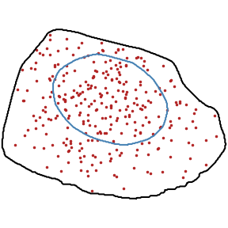
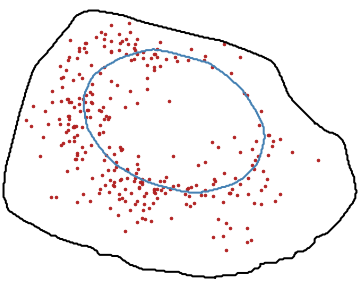

.. _pattern_simulation overview:

Pattern simulation
******************

.. currentmodule:: simfish

Functions used to simulate localization patterns.

+------------------+------------------+------------------+
|    **Random**    |     **Foci**     | **Intranuclear** |
+------------------+------------------+------------------+
|      |pic1|      |      |pic2|      |      |pic3|      |
+------------------+------------------+------------------+
| **Nuclear_edge** |  **Perinuclear** |   **Cell_edge**  |
+------------------+------------------+------------------+
|      |pic4|      |      |pic5|      |      |pic6|      |
+------------------+------------------+------------------+
|  **Protrusion**  |                  |                  |
+------------------+------------------+------------------+
|      |pic7|      |                  |                  |
+------------------+------------------+------------------+

.. |pic2| image:: ../../images/foci_1_300.png
   :width: 100%

.. |pic3| image:: ../../images/intranuclear_1_300.png
   :width: 100%

.. |pic4| image:: ../../images/nuclear_edge_1_300.png
   :width: 100%

.. |pic6| image:: ../../images/cell_edge_1_300.png
   :width: 100%

.. |pic7| image:: ../../images/protrusion_1_300.png
   :width: 100%

We build a map of probability distribution to bias the localization of
generated spots. Maps are built from specific cell templates:

* :func:`simfish.build_probability_map`

Several map are available in 3D:

* :func:`simfish.get_random_probability_map`
* :func:`simfish.get_random_out_probability_map`
* :func:`simfish.get_random_in_probability_map`
* :func:`simfish.get_nuclear_edge_probability_map`
* :func:`simfish.get_perinuclear_probability_map`
* :func:`simfish.get_cell_edge_probability_map`
* :func:`simfish.get_protrusion_probability_map`

We can simulate ground truth coordinates based on these probability maps:

* :func:`simfish.simulate_localization_pattern`

.. autofunction:: get_random_probability_map
.. autofunction:: get_random_out_probability_map
.. autofunction:: get_random_in_probability_map
.. autofunction:: get_nuclear_edge_probability_map
.. autofunction:: get_perinuclear_probability_map
.. autofunction:: get_cell_edge_probability_map
.. autofunction:: get_protrusion_probability_map
.. autofunction:: build_probability_map
.. autofunction:: simulate_localization_pattern