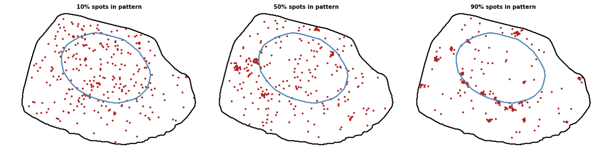
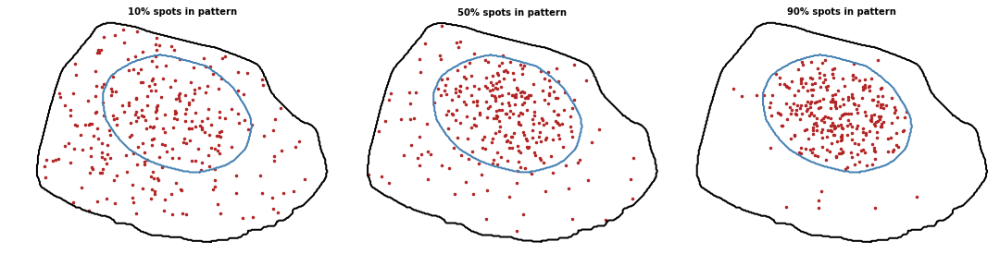
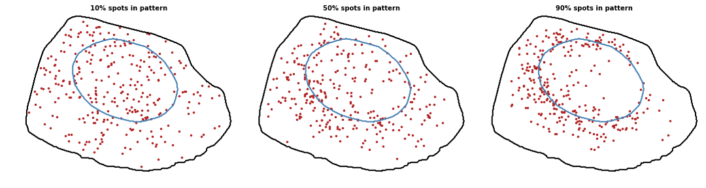
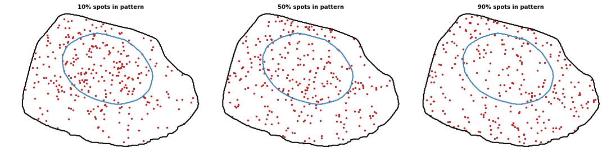
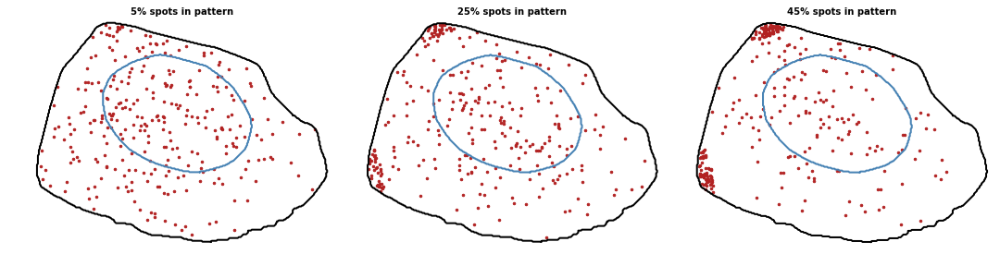

.. _pattern_simulation overview:

Pattern simulation
******************

.. currentmodule:: simfish

Functions used to simulate localization patterns.

We implemented 9 patterns (8 localized patterns + 1 default random pattern) in
3D. The percentage of localized spots defines the pattern strength:

* **Random**

|pic1|

* **Foci**

|pic2|

* **Intranuclear**

|pic3|

* **Extranuclear**

|pic4|

* **Nuclear edge**

|pic5|

* **Perinuclear**

|pic6|

* **Cell edge**

|pic7|

* **Pericellular**

|pic8|

* **Protrusion**

|pic9|

.. |pic1| image:: ../../images/random_1_300.png
   :width: 50%

.. |pic5| image:: ../../images/nuclear_edge_panel.png
   :width: 100%

We build a map of probability distribution to bias the localization of
generated spots. Maps are built from specific cell templates:

* :func:`simfish.build_probability_map`

We can simulate ground truth coordinates based on these probability maps:

* :func:`simfish.simulate_localization_pattern`

.. autofunction:: build_probability_map
.. autofunction:: simulate_localization_pattern